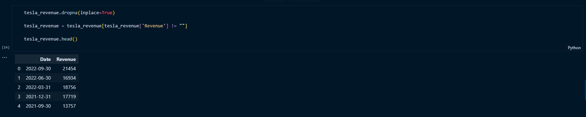
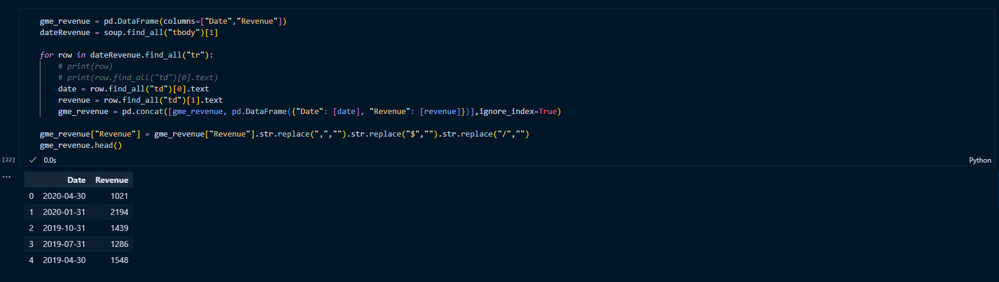
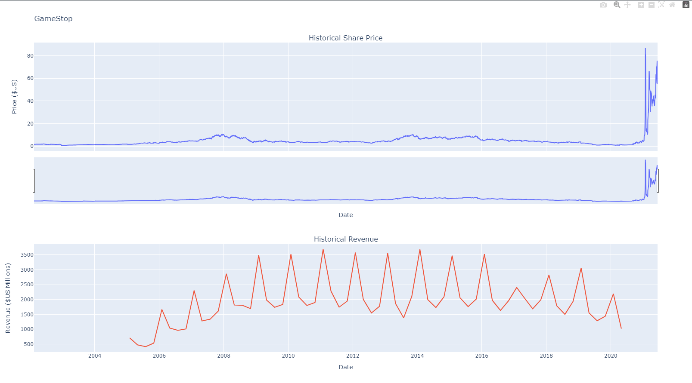

# Extracting and visualising stock data

# Description
This project applies Python in Jupyter Notebook to extract the revenue data for Tesla and Gamestop and build a dashboard to compare the price of the stock and the revenue.

# Usage

Please refer to the Jupyter Notebook "Final project.ipynb" in the repo.

# Library

The project utilises Python libraries:
    * Pandas
    * yfinance
    * requests
    * Beautiful Soup
    * plotly
    * warnings

These libraries need to be installed in the working environment before running the Jupyter Notebook, using Terminal or command prompt.

# Tesla stock and revenue dashboard

    1. Extracting Tesla Stock Data Using yfinance

The `teslaData` Dataframe originally consists of 3400 rows with 7 columns.

**Reset the index** using the `reset_index(inplace=True)` function on the tesla_data DataFrame and display the first five rows of the `teslaData` dataframe using the `head` function.

    2. Extracting Tesla Revenue Data Using Webscraping

Using `BeautifulSoup` or the `read_html` function extract the table with `Tesla Revenue` and store it into a dataframe named `tesla_revenue`. The dataframe should have columns `Date` and `Revenue`.

Remove the comma and dollar sign from the `Revenue` column. 

Remove an null or empty strings in the `Revenue` column.

Display the last 5 row of the `tesla_revenue` dataframe using the `tail` function.

    3. Tesla dashboard

# Gamestop stock and revenue dashboard

    1. Extracting Gamestop Stock Data using yfinance

Using the `Ticker` function enter the ticker symbol of the stock we want to extract data on to create a ticker object. The stock is GameStop and its ticker symbol is `GME`.

Using the ticker object and the function `history` extract stock information and save it in a dataframe named `gme_data`.

**Reset the index** using the `reset_index(inplace=True)` function on the gme_data DataFrame and display the first five rows of the `gme_data` dataframe using the `head` function.

    2. Extracting Gamestop Revenue data

Use the `requests` library to download the webpage https://cf-courses-data.s3.us.cloud-object-storage.appdomain.cloud/IBMDeveloperSkillsNetwork-PY0220EN-SkillsNetwork/labs/project/stock.html. Save the text of the response as a variable named `html_data`.

Parse the html data using `beautiful_soup`.

Using `BeautifulSoup` or the `read_html` function extract the table with `GameStop Revenue` and store it into a dataframe named `gme_revenue`. The dataframe should have columns `Date` and `Revenue`.

Display the last five rows of the `gme_revenue` dataframe using the `tail` function.

    3. Gamestop dashboard

# Licence

MIT